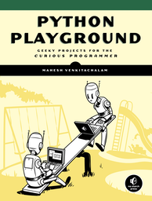

# Python Playground 

Python is a powerful programming language that’s easy to learn and fun to play with. But once you’ve gotten a handle on the basics, what do you do next?

Python Playground is a collection of imaginative programming projects that will inspire you to use Python to make art and music, build simulations of real-world phenomena, and interact with hardware like the Arduino and Raspberry Pi. You’ll learn to use common Python tools and libraries like numpy, matplotlib, and pygame.

Do check out the book at the [No Starch Press website](https://nostarch.com/pythonplayground)!

